**Лабораторная работа 6. Обработка ошибок в REST-сервисе**

# Обработка ошибок в REST-сервисе

## Задание

> Таблица БД, а также код для работы с ней был взят из предыдущих работ без изменений. 

Выполнить задание из лабораторной работы 3, но с использованием REST-сервиса:

1. Основываясь на информации из раздела 3.6 добавить поддержку обработки ошибок в сервис. 
2. Возможные ошибки, которые могут происходить при добавлении новых записей - например, неверное значение одного из полей, при изменении, удалении - попытка изменить или удалить несуществующую запись. 
3. Соответствующим образом необходимо обновить клиентское приложение.

## Ход работы

В pom.xml оставляем зависимости:

```xml
<dependencies>
        <dependency>
            <groupId>com.sun.jersey</groupId>
            <artifactId>jersey-server</artifactId>
            <version>1.19.4</version>
        </dependency>
        <dependency>
            <groupId>com.sun.jersey</groupId>
            <artifactId>jersey-servlet</artifactId>
            <version>1.19.4</version>
        </dependency>
        <dependency>
            <groupId>com.sun.jersey</groupId>
            <artifactId>jersey-grizzly2</artifactId>
            <version>1.19.4</version>
        </dependency>
        <dependency>
            <groupId>com.sun.jersey</groupId>
            <artifactId>jersey-json</artifactId>
            <version>1.19.4</version>
        </dependency>
        <dependency>
            <groupId>com.sun.jersey</groupId>
            <artifactId>jersey-client</artifactId>
            <version>1.19.4</version>
        </dependency>
        <dependency>
            <groupId>org.postgresql</groupId>
            <artifactId>postgresql</artifactId>
            <version>42.2.20</version>
        </dependency>
    </dependencies>
```

Основной код классов берем из лабораторной работы 5 и реализуем обработку ошибок. 

Интерфейс ExceptionMapper в JAX-RS является обработчиком ошибок. Соответственно, для обработки исключения необходимо создать соответствующий класс исключения, унаследовав его от Exception, а также создать класс, реализующий интерфейс ExceptionMapper, с аннотацией `@Provider`. Для исключительных ситуаций мы будем лишь отдавать соответствующий статус ответа, а в тело ответа также поместим текст ошибки. Далее остается зарегистрировать созданный класс в App.java, для чего необходимо лишь указать пакет, заменив строку:

```java
ResourceConfig resourceConfig = new ClassNamesResourceConfig(StudentResource.class);
```

на:

```java
ResourceConfig resourceConfig = new PackagesResourceConfig(StudentResource.class.getPackage().getName());
```

Из обозначенного пакеты JAX-RS выбирает специальным образом аннотированные классы для регистрации. То есть далее мы добавляем к классу StudentResource аннотацию `@Produces({MediaType.APPLICATION_JSON})` и в зависимости от требований выбрасываем нужное исключение.

Ввиду того, что в клиентском приложении мы лишь получаем и выводим ответ о статусе операции, то дополнительной работы с клиентом при обработке ошибок нет. В случае ошибки нам лишь нужно будет вывести соответствующий статус ответа.

Теперь будем вносить изменения в ранее разработанный веб-сервис для обработки ошибок. Основной класс сервиса `StudentResource` содержит веб-методы:

* getStudent();
* createStudent();
* deleteStudent();
* updateStudent().

Далее по аналогии с лабораторной работой 3 будем поочередно рассматривать обозначенные методы и добавлять к ним обработку ошибок. 

## Метод getStudent()

Данный метод производит поиск по переданному списку полей в таблице в БД и возвращает список записей, в которых есть указанные поля или их части (подстроки). Если не передать аргументов вообще, то результат будет пустым списком, если передать поле со значением, которого нет в таблице БД, то также вернется пустой результат. Соответственно, в подобных случаях как правило ошибок не возникает.

## Метод createStudent()

Метод `createStudent()` принимает в качестве параметров значения полей:

```java
@QueryParam("studentName") String name,
@QueryParam("studentSurname") String surname,
@QueryParam("studentAge") String age,
@QueryParam("studentId") String studentId,
@QueryParam("studentMark") String mark
```

Возвращает `String status`, т. е. строку с указанием статуса операции в виде минус единицы ("-1" - операция не выполнена и в лог записана ошибка SQLException), нуля ("0" - ошибка при выполнении операции) и единицы ("1" - операция успешно выполнена) .

В данном методе нам нужно получить все параметры (поля записи) и выбросить исключение, если не было задано значения какого-либо аргумента. С другой стороны, значения `studentAge` и `studentId` должны иметь возможность приведения к целым числам, а `studentMark` принимать значения `неудовлетворительно, удовлетворительно, хорошо, отлично`. В соответствии с этим, рассмотрим следующие случаи исключительных ситуаций:

* Если отсутствует значение для какого-либо из параметров - EmptyFieldException;
* Если значение для параметров  `studentAge` и `studentId` не могут быть приведены к целочисленному типу данных (int) - CastToIntException;
* Если значение `studentMark` отличается от возможных: `неудовлетворительно, удовлетворительно, хорошо, отлично` - MarkFieldValueException.

Для каждого обозначенного случая будем возвращать соответствующее исключение. 

Сразу создаем три класса с сообщениями об ошибках:

EmptyFieldException:

```java
public class EmptyFieldException extends Exception {
    private static final long serialVersionUID = -6647544772732631047L;

    public static EmptyFieldException DEFAULT_INSTANCE = new EmptyFieldException("Some fields cannot be null or empty");

    public EmptyFieldException(String message) {
        super(message);
    }
}
```

CastToIntException:

```java
public class CastToIntException extends Exception {
    private static final long serialVersionUID = -6647544772732631047L;

    public static CastToIntException DEFAULT_INSTANCE = new CastToIntException("Some fields values cannot be convert to integers");

    public CastToIntException(String message) {
        super(message);
    }
}
```

MarkFieldValueException:

```java
public class MarkFieldValueException extends Exception {
    private static final long serialVersionUID = -6647544772732631047L;

    public static MarkFieldValueException DEFAULT_INSTANCE = new MarkFieldValueException("Field 'mark'" +
            " Field 'mark' should have one of these values: 'неудовлетворительно', " +
            "'удовлетворительно', 'хорошо', 'отлично'");

    public MarkFieldValueException(String message) {
        super(message);
    }
}
```

И также создаем соответствующие классы ExceptionMapper:

EmptyFieldExceptionMapper:

```java
@Provider
public class EmptyFieldExceptionMapper implements ExceptionMapper<EmptyFieldException> {
    @Override
    public Response toResponse(EmptyFieldException ex) {
        return Response.status(Status.BAD_REQUEST).entity(ex.getMessage()).build();
    }
}
```

CastToIntExceptionMapper:

```java
@Provider
public class CastToIntExceptionMapper implements ExceptionMapper<CastToIntException> {
    @Override
    public Response toResponse(CastToIntException ex) {
        return Response.status(Response.Status.BAD_REQUEST).entity(ex.getMessage()).build();
    }
}
```

MarkFieldValueExceptionMapper:

```java
@Provider
public class MarkFieldValueExceptionMapper implements ExceptionMapper<MarkFieldValueException> {
    @Override
    public Response toResponse(MarkFieldValueException ex) {
        return Response.status(Response.Status.BAD_REQUEST).entity(ex.getMessage()).build();
    }
}
```

Далее вносим изменения в класс App:

```java
...
    
ResourceConfig resourceConfig = new PackagesResourceConfig(StudentResource.class.getPackage().getName());

...
```

И далее уже по аналогии с лабораторной работой 3 необходимо ввести проверку в класс StudentResource и выбрасывать соответствующие исключения через throw:

```java
// Добавляем обработку ошибок в метод createStudent()
    @POST
    public String createStudent(
            @QueryParam("studentName") String name,
            @QueryParam("studentSurname") String surname,
            @QueryParam("studentAge") String age,
            @QueryParam("studentId") String studentId,
            @QueryParam("studentMark") String mark)
            throws EmptyFieldException, CastToIntException, MarkFieldValueException {

        String status = "-1";

        if (name != null && !name.trim().isEmpty() &&
                surname != null && !surname.trim().isEmpty() &&
                age != null && !age.trim().isEmpty() &&
                studentId != null && !studentId.trim().isEmpty() &&
                mark != null && !mark.trim().isEmpty()) {

            try {
                Integer.parseInt(age.trim());
                Integer.parseInt(studentId.trim());

                if (mark.equals("неудовлетворительно") ||
                        mark.equals("удовлетворительно") ||
                        mark.equals("хорошо") ||
                        mark.equals("отлично")) {

                    status = new PostgreSQLDAO().createStudent(name, surname, age, studentId, mark);

                } else {
                    throw MarkFieldValueException.DEFAULT_INSTANCE;
                }

            } catch (NumberFormatException ex) {
                throw new CastToIntException("An error occurred when trying to convert 'age' and `student_id` to integers. ");
            }

        } else {
            throw EmptyFieldException.DEFAULT_INSTANCE;
        }

        return status;

    }
```

Также для исключения CastToIntException мы создаем новый объект с сообщением, в котором передаем вывод исключения NumberFormatException.

При запуске в консоли можно увидеть сообщение о найденных классах исключений:

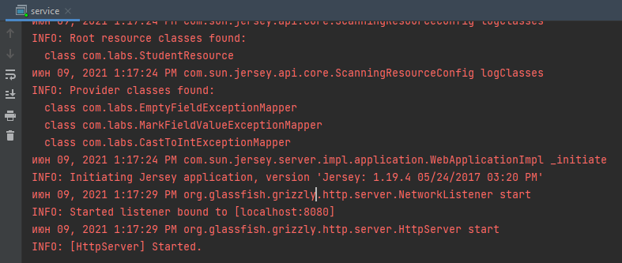

Для проверки потребуется также изменить код клиента, в котором необходимо убрать обработку данных исключений. Проверка в клиентском приложении как правило позволяет исключить обращения к сервису, если обозначенные данные введены неверно. Ввиду того, что в данной работе необходимо сделать проверку возвращаемых сервисом ошибок, изначально убираем проверку переданных клиенту данных и выводим ответ сервиса в консоль. Попробуем сделать запрос CREATE без указания значения в поле name:

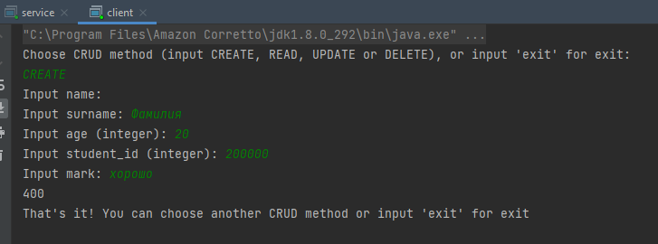

Вывод статуса 400 означает ошибку при выполнении данного запроса, но мы не получили на консольный вывод ранее указанное сообщение, т.к. не реализовали это в клиенте. Попробуем сделать запрос при помощи Postman (программное обеспечение для работы с API):

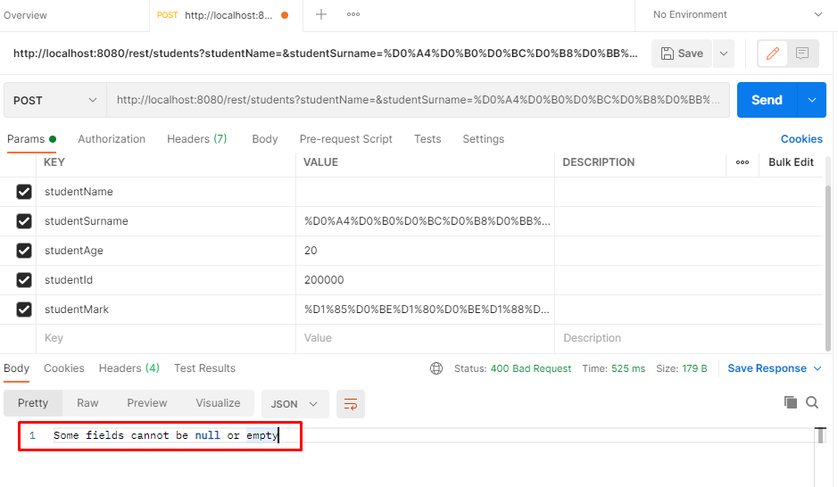

Таким образом мы получили сообщение в теле ответа. 

Теперь изменим код клиента для возможности получения данных из тела ответа:

```java
    private static void createStudent(Client client) {

        // Консольный ввод аргументов
        Scanner scanner = new Scanner(System.in);
        System.out.print("Input name: ");
        String name = scanner.nextLine();
        System.out.print("Input surname: ");
        String surname = scanner.nextLine();
        System.out.print("Input age (integer): ");
        String age = scanner.nextLine();
        System.out.print("Input student_id (integer): ");
        String studentId = scanner.nextLine();
        System.out.print("Input mark: ");
        String mark = scanner.nextLine();

        // проверим ввод на наличие значений: строка не является пустой и не состоит из пробелов
        WebResource webResource = client.resource(URL);
        webResource = webResource.queryParam("studentName", name).queryParam("studentSurname",
                        surname).queryParam("studentAge", age).queryParam("studentId",
                        studentId).queryParam("studentMark", mark);

        ClientResponse response = webResource.accept(MediaType.APPLICATION_JSON).post(ClientResponse.class);

        System.out.println(response.getStatus());
        System.out.println(response.getEntity(new GenericType<String>() {}));

    }
```


И попробуем выполнить запрос в консоли ещё раз:

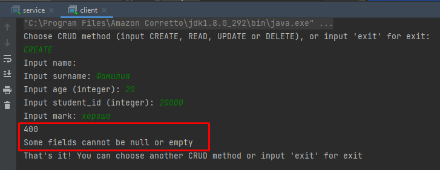

Теперь мы получили и статус и сообщение в теле ответа сервиса.

Попробуем выполнить запрос со значением age, которое нельзя привести к целочисленному типу:

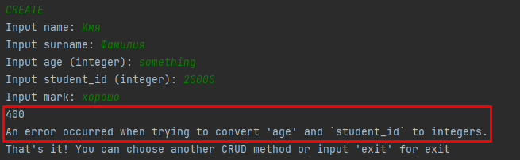

Получаем соответствующий код ошибки и сообщение, ранее указанное для подобного исключения.

Для метода deleteStudent() будем обрабатывать следующие ошибки:

* В случае, когда rowId является null или пустой строкой, а также когда нельзя привести к целому числу мы не будем делать запрос к БД, а сразу будем выбрасывать соответствующее исключение, которое было подготовлено при работе с исключениями метода createStudent().
* В случаях, когда возвращается статус "0" будем выбрасывать исключение о том, что в таблице в БД не было записи с указанным идентификатором - исключение rowIsNotExistsException.

Также создаем два класса:

rowIsNotExistsException:

```java
public class rowIsNotExistsException extends Exception {
    private static final long serialVersionUID = -6647544772732631047L;

    public static rowIsNotExistsException DEFAULT_INSTANCE = new rowIsNotExistsException("Row with this ID does not exist.");

    public rowIsNotExistsException(String message) {
        super(message);
    }
}
```

rowIsNotExistsExceptionMapper:

```java
@Provider
public class rowIsNotExistsExceptionMapper implements ExceptionMapper<rowIsNotExistsException> {
    @Override
    public Response toResponse(rowIsNotExistsException ex) {
        return Response.status(Response.Status.BAD_REQUEST).entity(ex.getMessage()).build();
    }
}
```


Затем соответствующим образом добавляем обработку указанных ошибок в классе StudentResource:

```java
    @DELETE
    public String deleteStudent(@QueryParam("rowId") String rowId) 
            throws EmptyFieldException, rowIsNotExistsException, CastToIntException {
        String status;
        if (rowId != null && !rowId.trim().isEmpty()) {
            try {
                Integer.parseInt(rowId.trim());
                status = new PostgreSQLDAO().deleteStudent(rowId);
                if (status.equals("0")) {
                    throw rowIsNotExistsException.DEFAULT_INSTANCE;
                }
            } catch (NumberFormatException ex) {
                throw new CastToIntException("An error occurred when trying to convert 'rowId' to integer. ");
            }
        } else {
            throw EmptyFieldException.DEFAULT_INSTANCE;
        }
        return status;
    }
```

Далее изменим класс клиента ClientApp:

```java
    private static void deleteStudent(Client client) {
        // Консольный ввод аргументов
        Scanner scanner = new Scanner(System.in);
        System.out.print("Input rowId (integer): ");
        String rowId = scanner.nextLine();


        WebResource webResource = client.resource(URL);
        webResource = webResource.queryParam("rowId", rowId);
        ClientResponse response = webResource.accept(MediaType.APPLICATION_JSON).delete(ClientResponse.class);

        System.out.println(response.getEntity(new GenericType<String>() {}));
        System.out.println(response.getStatus());

    }
```

При запуске сервиса видим в логах новый класс исключения:

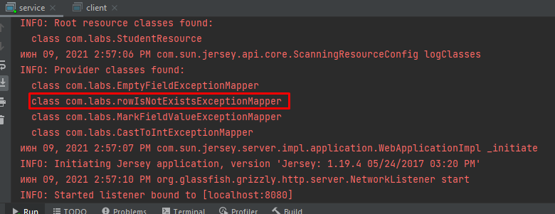

Далее запустим клиент и попробуем выполнить запрос DELETE с несуществующим rowId:

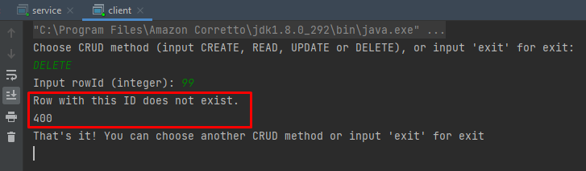

Далее переходим к обработке исключений метода updateStudent().

* Если отсутствует rowId или он не является числом;
* Если строку с указанным rowId не удалось найти
* Если все остальные поля пустые;
* Если `studentAge, studentId` невозможно привести к целому числу;
* Если поле 'mark' не содержит одного из возможных значений: 'неудовлетворительно', ' удовлетворительно', 'хорошо', 'отлично'.

Все классы исключений были созданы ранее, теперь остается добавить проверки в класс StudentResource:

```java
    @PUT
    public String updateStudent(
            @QueryParam("rowId") String rowId,
            @QueryParam("studentName") String name,
            @QueryParam("studentSurname") String surname,
            @QueryParam("studentAge") String age,
            @QueryParam("studentId") String studentId,
            @QueryParam("studentMark") String mark)
            throws EmptyFieldException, CastToIntException, MarkFieldValueException,
            rowIsNotExistsException {

        String status;
        List<String> updateArgs = new ArrayList<>();

        if (rowId != null && !rowId.trim().isEmpty()) {
            if ((name != null && !name.trim().isEmpty()) ||
                    (surname != null && !surname.trim().isEmpty()) ||
                    (age != null && !age.trim().isEmpty()) ||
                    (studentId != null && !studentId.trim().isEmpty()) ||
                    (mark != null && !mark.trim().isEmpty())) {

                try {
                    Integer.parseInt(rowId.trim());
                    if (name != null && !name.trim().isEmpty()) updateArgs.add("name = '" + name + "'");
                    if (surname != null && !surname.trim().isEmpty()) updateArgs.add("surname = '" + surname + "'");
                    try {
                        if (age != null && !age.trim().isEmpty()) {
                            Integer.parseInt(age.trim());
                            updateArgs.add("age = '" + age + "'");
                        }
                        if (studentId != null && !studentId.trim().isEmpty()) {
                            Integer.parseInt(studentId.trim());
                            updateArgs.add("student_id = '" + studentId + "'");
                        }
                    } catch (NumberFormatException e) {
                        throw new CastToIntException("An error occurred when trying to convert " +
                            "'age' or 'studentId' to integer. ");
                    }
                } catch (NumberFormatException e) {
                    throw new CastToIntException("An error occurred when trying to convert 'rowId' to integer. ");
                }
            } else {
                throw EmptyFieldException.DEFAULT_INSTANCE;
            }
        } else {
            throw new EmptyFieldException("rowID cannot be empty!");
        }

        if (mark != null && !mark.trim().isEmpty()) {
             if (mark.equals("неудовлетворительно") ||
                    mark.equals("удовлетворительно") ||
                    mark.equals("хорошо") ||
                    mark.equals("отлично")) {
                updateArgs.add("mark = '" + mark + "'");
            } else {
                throw MarkFieldValueException.DEFAULT_INSTANCE;
            }
        }

        status = new PostgreSQLDAO().updateStudent(rowId, updateArgs);
        if (status.equals("0")) {
            throw rowIsNotExistsException.DEFAULT_INSTANCE;
        }

        return status;
    }
```

Теперь точно также убираем проверки из клиента, но изначально убедимся в перехвате исключений при помощи запросов из Postman:

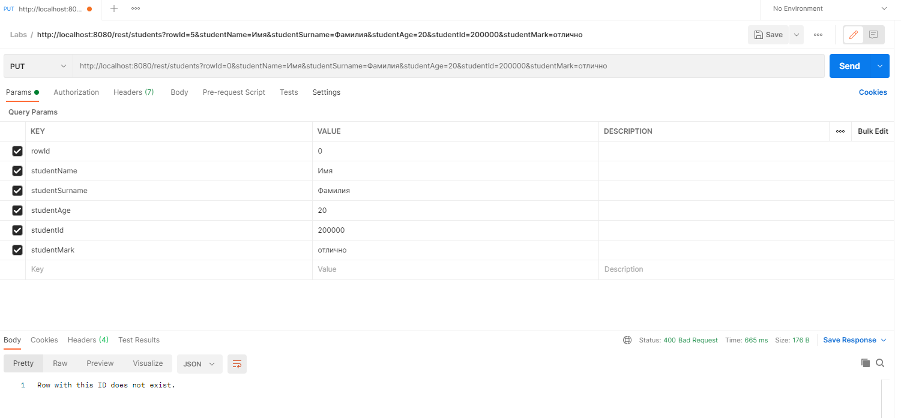

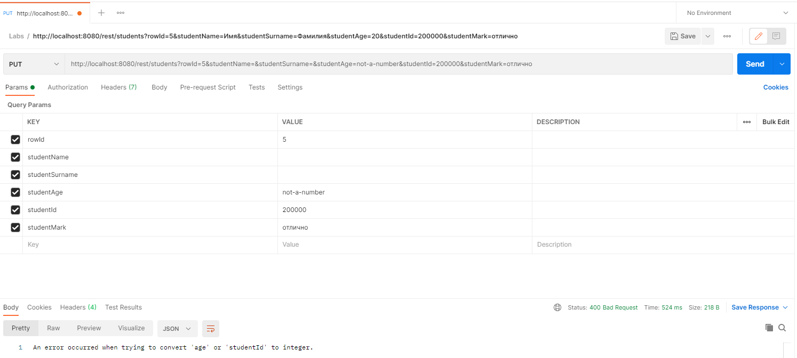

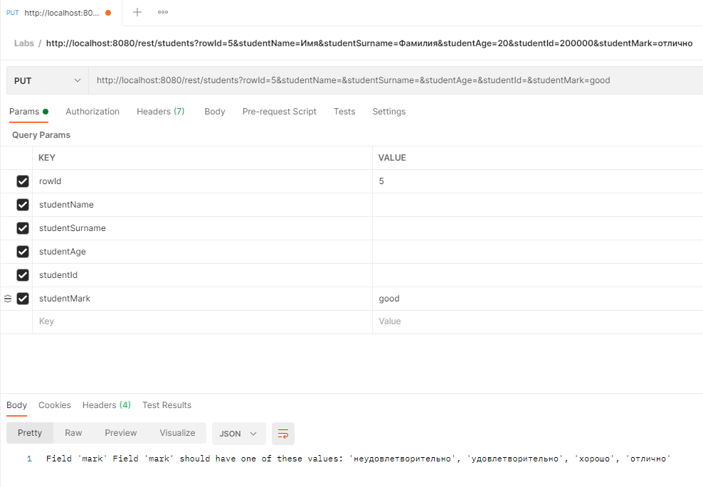


И теперь переходим к изменению класса клиента ClientApp:

```java
    private static void updateStudent(Client client) {
        Scanner scanner = new Scanner(System.in);
        System.out.print("Input rowID (integer): ");
        String rowId = scanner.nextLine();
        System.out.println("What fields you want update for this row? \n" +
                    "Choose fields from 'name', 'surname', 'age', 'student_id', 'mark' and input it's below \n" +
                    " separated by comma without spaces");
        String updateRows = scanner.nextLine();
        String[] updateRowsList = updateRows.split(",", -1);
        Map<String, String> updateRowsMap = new HashMap<>();
        updateRowsMap.put("name", "");
        updateRowsMap.put("surname", "");
        updateRowsMap.put("age", "");
        updateRowsMap.put("student_id", "");
        updateRowsMap.put("mark", "");

        for (String row : updateRowsList) {
            switch (row) {
                case "name":
                    System.out.println("Input new value for 'name' field:");
                    String name = scanner.nextLine();
                    updateRowsMap.put("name", name);
                    break; 
                case "surname":
                    System.out.println("Input new value for 'surname' field:");
                    String surname = scanner.nextLine();
                    updateRowsMap.put("surname", surname);
                    break;
                case "age":
                    System.out.println("Input new value for 'age' field (integer):");
                    String age = scanner.nextLine();
                    updateRowsMap.put("age", age);
                    break;
                case "student_id":
                    System.out.println("Input new value for 'student_id' field (integer):");
                    String student_id = scanner.nextLine();
                    updateRowsMap.put("student_id", student_id);
                    break;
                case "mark":
                    System.out.println("Input new value for 'mark' field:");
                    String mark = scanner.nextLine();
                    updateRowsMap.put("mark", mark);
                    break;
        }

        System.out.println("You input new values for row " + rowId + ":\n" + updateRowsMap);
        System.out.println("Do you really want to change this fields for row " + rowId + "? (y -> yes, other -> no)");
        String agree = scanner.nextLine();
        if (agree.equals("y")) {
                String name = updateRowsMap.get("name");
                String surname = updateRowsMap.get("surname");
                String age = updateRowsMap.get("age");
                String studentId = updateRowsMap.get("student_id");
                String mark = updateRowsMap.get("mark");

                WebResource webResource = client.resource(URL);
                webResource = webResource.queryParam("rowId",
                            rowId).queryParam("studentName", name).queryParam("studentSurname",
                            surname).queryParam("studentAge", age).queryParam("studentId",
                            studentId).queryParam("studentMark", mark);
                ClientResponse response = webResource.accept(MediaType.APPLICATION_JSON).put(ClientResponse.class);

                System.out.println(response.getStatus());
                System.out.println(response.getEntity(new GenericType<String>() {}));
                
        } else {
                System.out.println("You just cancel your request. Try another request or exit."); 
        }
    }
```


В данном случае мы попросту убрали проверки полей при их добавлении и будем отправлять то, что было введено, чтобы сервис обрабатывал их самостоятельно и возвращал соответствующий ответ.

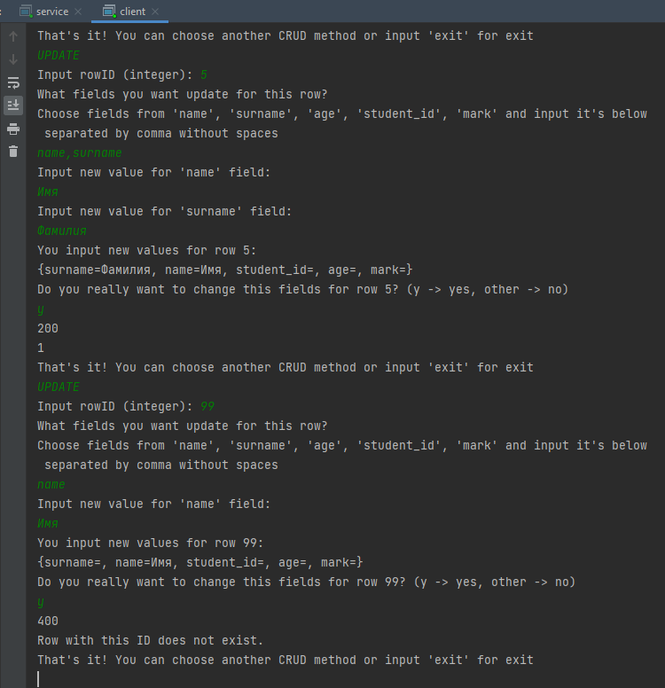

